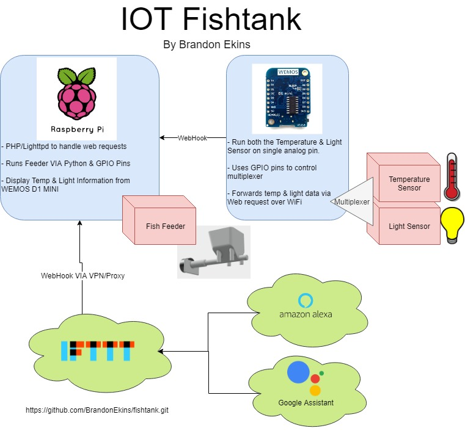
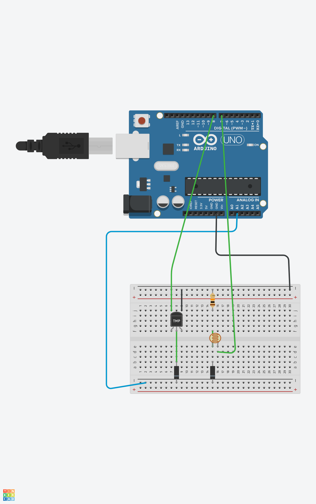

# IOT Fish Tank

## Project Outline

The goal of this project is to simplify the different tasks associated with taking care of fish. While my wife thought it was a great idea to buy some beta fish a couple of years ago their numbers have dropped from 2 to 1 because of our inability to give them proper care. This project should extend the life of our remaining Beta as we can now feed him remotely and be notified of when he needs to be cleaned.

## Project Diagram

2. Tank Cleanliness sensor
    - Photo Resistor 
    - Wemos D1 Mini
    - LED Light
## Circuit

5. Button
    - Wemos D1 Mini
    - Button
    - OLED Display

Requirements:

## Final Project

Apply the principles you have learned in this class by designing your own IoT system that solves a real-life need. These don’t have to be massive, world-changing needs, but should be useful in your personal life.

Some examples are:

“In my apartment complex, I never know when my clothes are done in the dryer in the laundry room. I want to build a small device that recognized when the dryer finishes, and then flashes LEDs in a few rooms in my apartment.”

“I worry about packages being stolen from my front porch. I want to design a large box for packages that can be physically attached to my porch. When empty, the box is unlocked. When a package is placed inside and the box is closed, it takes a picture and sends me a message then locks itself until I come home and click a button on my phone to unlock it.”

It could be a system to monitor your pet’s food or water. It could be something to show if the dishwasher is clean or dirty. It could check the temperature in a room and turn on or off a fan or outlet.

For the project, you will need to build a system that meets the following minimum technical requirements:

Utilize at least 3 physical devices (one sensor and two actuators, or two sensors and one actuator)

Utilize at least 2 wireless communication protocols (wifi, BLE, RFID, LoRa, etc)
wifi, mqtt & web interface
Utilize restful API

Utilize event hub or cloud IoT service
mqtt on raspberry pi
Utilize a non-web page interface (voice, IFTTT, chat)
slackbot

### Sources

http://www.esp8266learning.com/wemos-oled-shield-example.php

