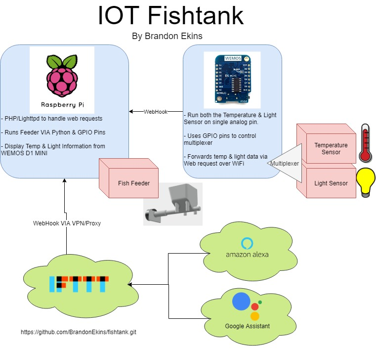
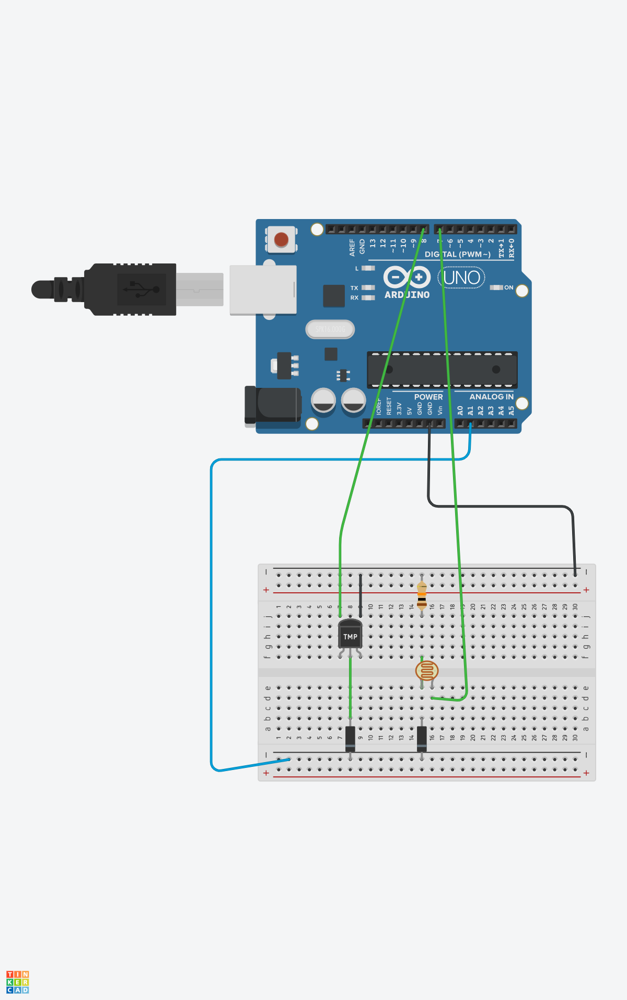

# IOT Fish Tank

## Project Outline

The goal of this project is to simplify the different tasks associated with taking care of fish. While my wife thought it was a great idea to buy some beta fish a couple of years ago their numbers have dropped from 2 to 1 because of our inability to give them proper care. This project should extend the life of our remaining Beta as we can now feed him remotely and be notified of when he needs to be cleaned.

## Project Diagram

## Circuits

### Measuring Circuit

### Button Circuit

## Part list

1. Raspberry Pi
    - Raspbian

2. Tank sensor
    - Photo Resistor 
    - Wemos D1 Mini
    - Thermometer

3. Auto Feeder
    - 3D printed hopper
    - 1/2 in drill bit
    - Drill bit adapter
    - 1/64 geared 5v stepper motor    

4. Physical Interface
    - Wemos D1 Mini
    - Button
    - OLED Display

Requirements:
Utilize at least 3 physical devices (one sensor and two actuators, or two sensors and one actuator)

Utilize at least 2 wireless communication protocols (wifi, BLE, RFID, LoRa, etc)
wifi, mqtt & web interface

Utilize restful API
basic information from tank sensor

Utilize event hub or cloud IoT service
mqtt on raspberry pi

Utilize a non-web page interface (voice, IFTTT, chat)
IFTTT

### Sources

http://www.esp8266learning.com/wemos-oled-shield-example.php

## Source Code
