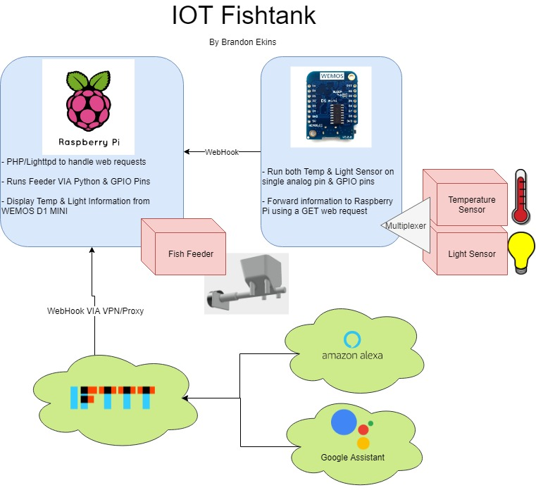

# IOT Fish Tank

## Project Outline

The goal of this project is to simplify the different tasks associated with taking care of fish. While my wife thought it was a great idea to buy some beta fish a couple of years ago their numbers have dropped from 2 to 1 because of our inability to give them proper care. This project should extend the life of our remaining Beta as we can now feed him remotely and be notified of when he needs to be cleaned.

## Project Diagram

